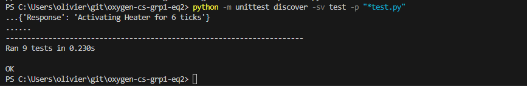

# Choix des tests python

**Tests des variables d'environnement :**

1. `test_variable_environnement` :
   - Vérifie si les variables d'environnement sont correctement définies dans l'objet `Main`.
   - Utilise des décorateurs `@mock.patch.dict` pour simuler les valeurs des variables d'environnement.
   - Vérifie que les variables d'environnement ont les valeurs attendues.

2. `test_variable_environnement_default` :
   - Vérifie si les variables d'environnement ont des valeurs par défaut correctement attribuées dans l'objet `Main` lorsque les variables d'environnement ne sont pas définies.
   - Utilise des décorateurs `@mock.patch.dict` pour simuler les valeurs des variables d'environnement.
   - Vérifie que les variables d'environnement ont les valeurs par défaut attendues.

3. `test_variable_token_invalide` :
   - Vérifie si une `ValueError` est levée lorsque la variable d'environnement `TOKEN` n'est pas définie.
   - Utilise `self.assertRaises` pour vérifier si une exception est levée lors de l'exécution du code.

**Tests des fonctions principales :**

4. `test_set_sensor_hub` :
   - Vérifie si la fonction `set_sensor_hub` de l'objet `Main` initialise correctement la connexion au hub des capteurs.
   - Utilise `self.assertIsNotNone` pour vérifier si l'objet de connexion n'est pas nul.

5. `test_analyze_datapoint_turn_on_ac` :
   - Vérifie si la fonction `analyze_datapoint` de l'objet `Main` appelle correctement la fonction `send_action_to_hvac` avec les paramètres attendus lorsque la température est supérieure à un seuil spécifique.
   - Utilise `self.main.send_action_to_hvac.assert_called_with` pour vérifier si la fonction a été appelée avec les bons arguments.

6. `test_analyze_datapoint_turn_on_heater` :
   - Vérifie si la fonction `analyze_datapoint` de l'objet `Main` appelle correctement la fonction `send_action_to_hvac` avec les paramètres attendus lorsque la température est inférieure à un seuil spécifique.
   - Utilise `self.main.send_action_to_hvac.assert_called_with` pour vérifier si la fonction a été appelée avec les bons arguments.

7. `test_analyze_datapoint_no_action` :
   - Vérifie si la fonction `analyze_datapoint` de l'objet `Main` n'appelle pas la fonction `send_action_to_hvac` lorsque la température ne correspond à aucune action spécifique.
   - Utilise `self.assertFalse` pour vérifier que la fonction n'a pas été appelée.

8. `test_send_event_to_database` :
   - Vérifie si la fonction `send_event_to_database` de l'objet `Main` appelle correctement la fonction `send_event_to_database` avec les paramètres attendus lorsque la fonction `send_action_to_hvac` est appelée.
   - Utilise `self.main.send_event_to_database.assert_called_with` pour vérifier si la fonction a été appelée avec les bons arguments.

9. `test_send_temperature_to_fastapi` :
   - Vérifie si la fonction `send_temperature_to_fastapi` de l'objet `Main` appelle correctement la fonction `print` avec les paramètres attendus.
   - Utilise `patch("builtins.print")` pour simuler la fonction `print` et `mock_print.assert_called_with` pour vérifier si la fonction a été appelée avec les bons arguments.

