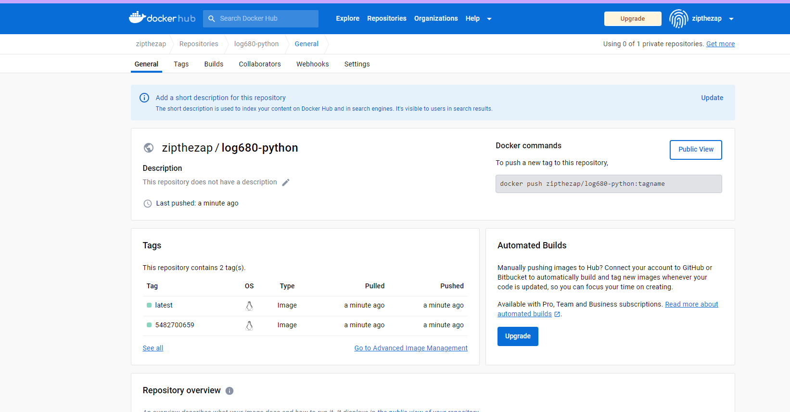
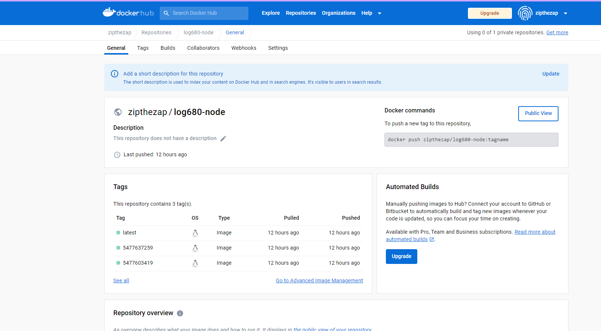

# Déploiement des images sur dockerhub
Chacun des déploiement dépose 2 images, une avec le tag du `run_id` de la pipeline qui la déployé et une avec le tag `latest`.
##### Images python

  
##### Images node

